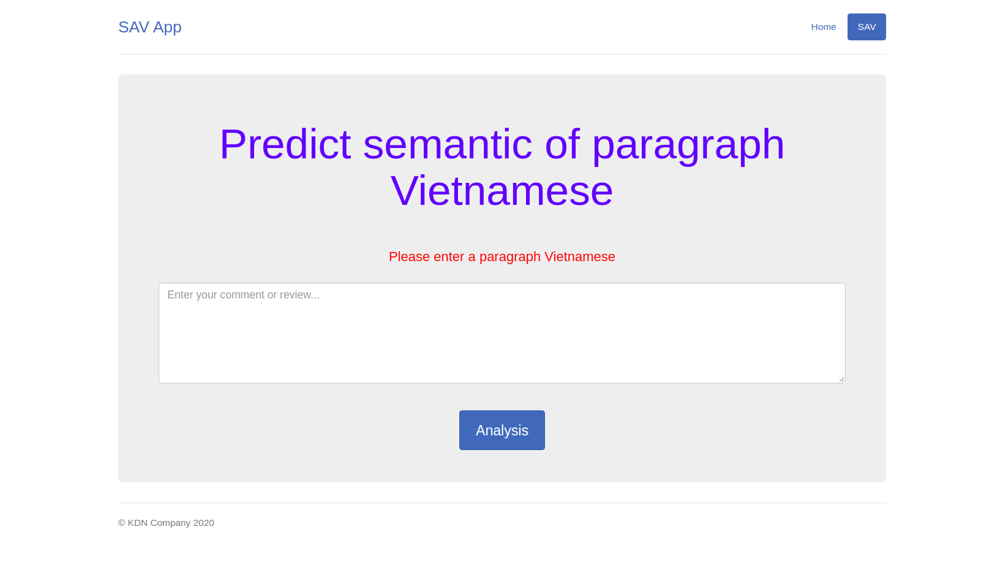

# semantic-analysis-vietnamese


It is my project to build a simple web app that can sematic analysis Vietnamese comment or review.

## How to use it

### 1. Clone this repo
```console
  git clone https://github.com/dangnam739/semantic-analysis-vietnamese
  cd <...>/semantic-analysis-vietnamese
```

### 2. Run file app.py
```console
  python app.py
```


Then, access the link: http://127.0.0.1:5000/ with default web browser.

Result is SAV App's homepage that shows the introduction of SAV. 


### 3. Try analysis a paragraph vietnamese
Click `Try it now`  or `SVA`, then enter your comment or reivew about restaurant, film, hotel, place,...

_Example:_



The result is `positive` or `negative`:


If you want to try with another paragraph, click `Try it again`.


