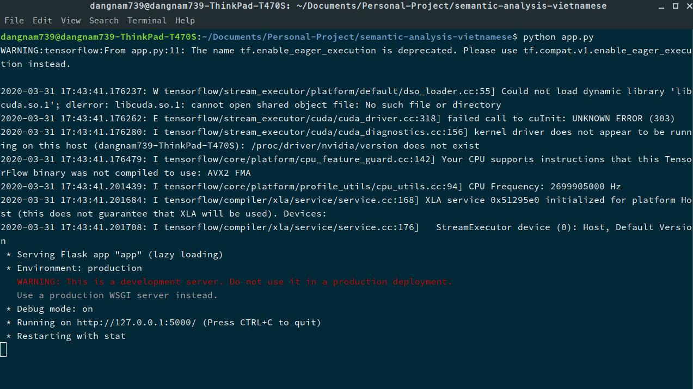
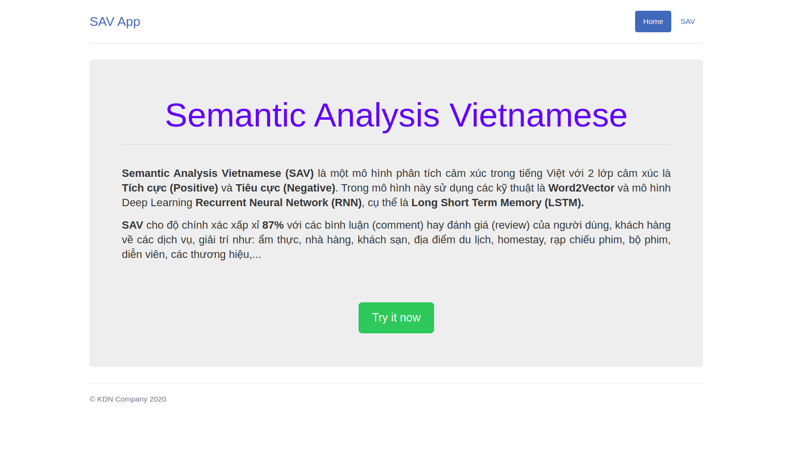
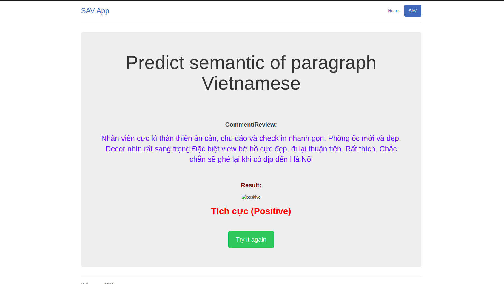

# semantic-analysis-vietnamese

It is my project to build a simple web app that can sematic analysis Vietnamese comment or review.

Để chạy ứng dụng web này, bạn cần truy cập vào terminal(trong Linix) hoặc cmd(trong windows) và chạy lệnh sau:

`$ cd <path_webApp>`
`$ python app.py`

Sau đó truy cập vào đường link mặc định:   http://127.0.0.1:5000/

Màn hình sẽ xuất hiện giao diện trang chủ giới thiệu cho SAV App

Để thực hiện chức năng SAV, nhấn vào `Try it now`  hoặc `SVA`, tiến hành nhập đoạn văn bình luận (comment) hoặc đánh giá (review) để phân tích

Kết quả cho ra sẽ được hiện thị như sau:

Bạn có thể tiếp tục thử với đoạn văn khác thông quá nút `Try it again`.

